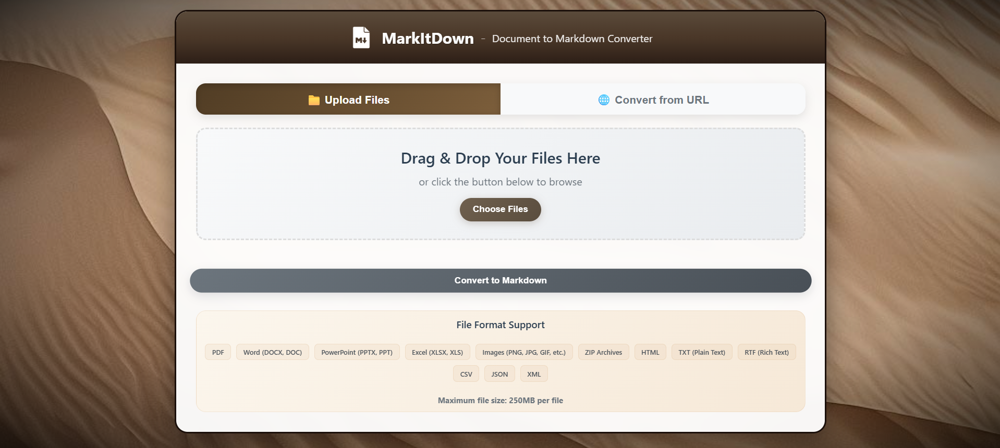
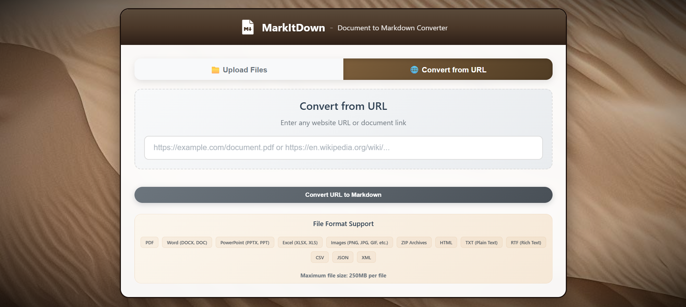
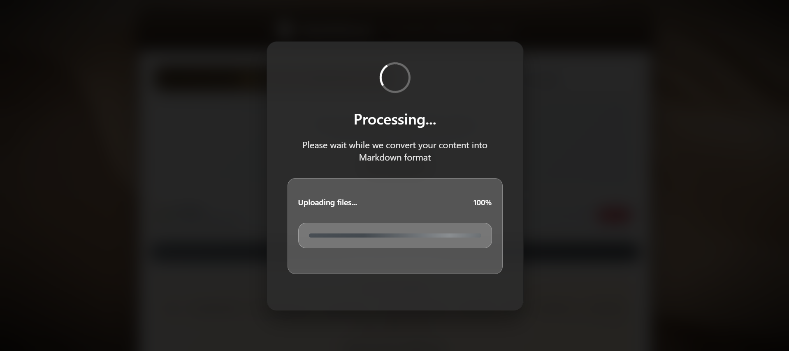

# MarkItDown Web Application

A powerful, production-ready web application for converting various document formats to Markdown. Built with Flask and optimized for deployment on Linux servers with Cloudflare Tunnel integration for secure internet access.

## Features

- **Multi-format Support**: PDF, DOCX, PPTX, XLSX, images, web pages, and more
- **OCR Capabilities**: Extract text from images using EasyOCR
- **Web Interface**: Clean, responsive UI for easy file uploads
- **API Access**: RESTful API for programmatic access
- **Production Ready**: Systemd service, logging, health checks
- **Secure Access**: Cloudflare Tunnel integration for secure internet access
- **Interactive Deployment**: Automated setup with customizable configuration

## System Requirements

### Software Requirements
- **Operating System**: Linux with systemd support
  - Synology DSM 7.0+
  - Ubuntu 18.04+
  - CentOS 7+
  - Debian 10+
  - RHEL 7+
- **Python**: 3.8 or higher
- **Root Access**: sudo/root privileges required for installation
- **Package Manager**: apt, yum, or pacman

### Network Requirements
- **Outbound Internet**: Required for package downloads and Cloudflare Tunnel
- **Local Port**: One available port (default: 8040, configurable)
- **Cloudflare Account**: Free account sufficient for tunnel setup

## Installation

### Step 1: Prepare Your Server

#### For Synology NAS:
```bash
# Enable SSH in Control Panel > Terminal & SNMP
# Connect via SSH as admin user, then switch to root
ssh admin@YOUR_HOSTMACHINE_IP
sudo -i
```

#### For Ubuntu/Debian:
```bash
# Update system packages
apt update && apt upgrade -y

# Install required system packages
apt install -y python3 python3-pip python3-venv curl wget unzip
```

#### For CentOS/RHEL:
```bash
# Update system packages
yum update -y

# Install required system packages
yum install -y python3 python3-pip curl wget unzip
```

### Step 2: Upload Project Files

```bash
# Create temporary directory for setup files
mkdir -p /tmp/markitdown-setup

# From your local machine, upload all project files
scp -r * root@YOUR_SERVER:/tmp/markitdown-setup/

# Verify upload (connect to your server)
ssh root@YOUR_SERVER "ls -la /tmp/markitdown-setup/"
```

### Step 3: Run Interactive Deployment

```bash
# Connect to your server and run the deployment script
ssh root@YOUR_SERVER
cd /tmp/markitdown-setup
chmod +x deploy.sh
./deploy.sh
```

#### Configuration Prompts

The deployment script will ask for the following information:

1. **Base Directory Path** (default: `/your/project/path`)
   - Where to create the `markitdown` folder
   - Examples: `/your/project/path` (Hostmachine), `/opt`, `/home/user`
   - Must be an absolute path starting with `/`

2. **Domain Name** (required)
   - Your custom domain (e.g., `example.com`)
   - Format: `domain.com` (no protocol, no subdomains)
   - Will create: `markitdown.yourdomain.com`

3. **Port Number** (default: `8040`)
   - Local port for the application
   - Range: 1024-65535
   - Ensure port is not in use: `netstat -tlnp | grep :8040`

4. **Application Name** (default: `markitdown`)
   - Name for the systemd service
   - Used for service file: `{name}.service`
   - Only letters, numbers, hyphens, underscores allowed

### Step 4: Cloudflare Tunnel Setup (Optional but Recommended)

#### 4.1: Create Cloudflare Tunnel via Dashboard

1. **Login to Cloudflare Dashboard**
   - Go to [https://dash.cloudflare.com](https://dash.cloudflare.com)
   - Login with your Cloudflare account

2. **Navigate to Zero Trust**
   - Click on "Zero Trust" in the left sidebar
   - If not set up, follow the setup wizard (free plan is sufficient)

3. **Access Tunnels Section**
   - Go to "Access" → "Tunnels"
   - Click "Create a tunnel"

4. **Configure Tunnel**
   - **Tunnel Name**: Enter a descriptive name (e.g., `markitdown-tunnel`)
   - **Environment**: Select "Cloudflared"
   - Click "Save tunnel"

5. **Copy Tunnel Information**
   - **Tunnel Token**: Copy the long token starting with `eyJ...`
   - **Tunnel ID**: Copy the UUID (format: `12345678-1234-1234-1234-123456789abc`)
   - Keep this information for the next step

6. **Configure Public Hostnames** (do this after server setup)
   - Add hostname: `markitdown.yourdomain.com`
   - Service: `http://localhost:8040` (use your configured port)
   - Add hostname: `health.markitdown.yourdomain.com`
   - Service: `http://localhost:8040/health`
   - Add hostname: `api.markitdown.yourdomain.com`
   - Service: `http://localhost:8040`

#### 4.2: Install Tunnel on Server

```bash
# Navigate to your project directory
cd /your/filepath/here/markitdown  # Use your configured path

# Run tunnel deployment script
./deploy_tunnel.sh deploy
```

#### Tunnel Configuration Prompts:

```
========================================
MarkItDown Web Application - Tunnel Setup
========================================

Enter project directory path [/your/project/path/markitdown]: /your/project/path/markitdown
Enter your domain name: mydomain.com
Enter your Cloudflare tunnel token: eyJhIjoiYWJjZGVmZ2hpams...
Enter your tunnel ID (UUID format): 12345678-1234-1234-1234-123456789abc
Enter tunnel name [markitdown]: markitdown-tunnel
Enter local port [8040]: 8040

Configuration Summary:
=====================
Project Directory: /your/project/path/markitdown
Domain: mydomain.com
Tunnel Name: markitdown-tunnel
Tunnel ID: 12345678-1234-1234-1234-123456789abc
Local Port: 8040
Main URL: https://markitdown.mydomain.com
Health URL: https://health.markitdown.mydomain.com
API URL: https://api.markitdown.mydomain.com

Continue with this configuration? (y/n): y
```

### Step 5: Verify Installation

```bash
# Check application service status
systemctl status markitdown.service

# Check tunnel service status (if configured)
systemctl status cloudflared

# Test local health endpoint
curl http://localhost:8040/health

# Test public endpoints (if tunnel configured)
curl https://health.markitdown.yourdomain.com/health
```
## Access URLs

After successful installation, your application will be available at:

- **Local Access**: `http://localhost:YOUR_PORT`
- **Main Application**: `https://markitdown.YOUR_DOMAIN` (if tunnel configured)
- **Health Check**: `https://health.markitdown.YOUR_DOMAIN`
- **API Access**: `https://api.markitdown.YOUR_DOMAIN`

## File Structure After Installation

```
/your/project/path/markitdown/
├── app.py                     # Main application
├── requirements.txt           # Python dependencies
├── templates/                 # HTML templates
├── static/                    # CSS, JS, images
├── venv/                      # Python virtual environment
├── logs/                      # Application and tunnel logs
├── models/                    # EasyOCR models directory
│   └── easyocr/              # EasyOCR models (auto-downloaded)
├── sessions/                  # Session storage
├── tmp/                       # Temporary files
├── backups/                   # Backup directory
├── cloudflare-tunnel.yml      # Tunnel configuration (if tunnel setup)
├── tunnel.env                 # Tunnel environment (if tunnel setup)
├── tunnel-credentials.json    # Tunnel credentials (auto-generated by cloudflared)
├── deployment.env             # Deployment configuration
├── DEPLOYMENT.md              # Deployment documentation
├── deploy.sh                  # Main deployment script
├── deploy_tunnel.sh           # Tunnel management script
├── start.sh                   # Service start helper
├── stop.sh                    # Service stop helper
├── status.sh                  # Service status helper
├── info.sh                    # Deployment info helper
└── health_check.sh            # Health check helper
```

## API Usage

```bash
# Convert file
curl -X POST -F "file=@document.pdf" https://api.markitdown.YOUR_DOMAIN/convert_async

# Convert URL
curl -X POST -d "url=https://example.com" https://api.markitdown.YOUR_DOMAIN/

# Health check
curl https://health.markitdown.YOUR_DOMAIN/health

# Local testing
curl -X POST -F "file=@document.pdf" http://localhost:YOUR_PORT/convert_async
```

## Dependencies

The installation script automatically installs these Python packages:

- **Core**: Flask, Werkzeug, Flask-Session
- **OCR**: EasyOCR (CPU-optimized for headless systems)
- **Documents**: python-docx, openpyxl, pdfminer.six, python-pptx, striprtf
- **Web**: requests, beautifulsoup4, youtube-transcript-api
- **Data**: pandas, lxml

## Performance

- **Startup Time**: <3 seconds
- **Memory Usage**: ~50MB base + ~200MB per OCR operation
- **Supported File Size**: Up to 250MB
- **Concurrent Users**: 10+ simultaneous conversions

## Security Features

- **No Hardcoded Secrets**: All sensitive information is entered during deployment
- **Secure Tunneling**: Cloudflare Tunnel for secure internet access
- **No Open Ports**: No need to open firewall ports
- **Service Isolation**: Systemd service with security restrictions
- **Input Validation**: File type and size validation
- **Template System**: Configuration files generated with user values

## Migration from Previous Version

If you have an existing deployment:

1. **Backup existing deployment**:
   ```bash
   tar -czf markitdown-backup-$(date +%Y%m%d).tar.gz -C /your/base/dir markitdown
   ```

2. **Stop existing services**:
   ```bash
   sudo systemctl stop markitdown.service cloudflared
   ```

3. **Deploy new version** using the installation steps above

4. **Update DNS records** in Cloudflare dashboard to point to new tunnel

## Troubleshooting

### Service Management Commands

```bash
# Check service status
sudo systemctl status YOUR_APP_NAME.service

# Start the service
sudo systemctl start YOUR_APP_NAME.service

# Stop the service
sudo systemctl stop YOUR_APP_NAME.service

# Restart the service
sudo systemctl restart YOUR_APP_NAME.service

# Enable service to start on boot
sudo systemctl enable YOUR_APP_NAME.service

# Disable service from starting on boot
sudo systemctl disable YOUR_APP_NAME.service
```

### Real-time Logging

```bash
# View application logs in real-time
tail -f /your/project/path/markitdown/logs/markitdown.log

# View system service logs in real-time
journalctl -u YOUR_APP_NAME.service -f

# View tunnel logs in real-time (if configured)
journalctl -u cloudflared -f

# View last 50 lines of application logs
tail -n 50 /your/project/path/markitdown/logs/markitdown.log

# View last 50 lines of system service logs
journalctl -u YOUR_APP_NAME.service -n 50
```

### Tunnel Management

```bash
# Check tunnel status
sudo systemctl status cloudflared

# Start tunnel service
sudo systemctl start cloudflared

# Stop tunnel service
sudo systemctl stop cloudflared

# Restart tunnel service
sudo systemctl restart cloudflared

# Test tunnel connectivity
cloudflared tunnel info YOUR_TUNNEL_ID

# View tunnel configuration
cat /your/project/path/markitdown/cloudflare-tunnel.yml
```

### Common Issues

#### Permission Issues
```bash
# Fix file permissions
cd /your/project/path/markitodown
sudo chown -R http:http .
sudo chmod -R 755 .
sudo chmod 777 models/easyocr sessions tmp logs
```

#### Port Already in Use
```bash
# Check what's using the port
sudo netstat -tlnp | grep :8040
sudo lsof -i :8040

# Kill process using the port (if safe to do so)
sudo kill -9 PID_NUMBER
```

#### Service Won't Start
```bash
# Check service logs for errors
journalctl -u YOUR_APP_NAME.service -n 50

# Check if Python virtual environment is working
cd /your/project/path
source venv/bin/activate
python app.py

# Reload systemd configuration
sudo systemctl daemon-reload
sudo systemctl restart YOUR_APP_NAME.service
```

#### Tunnel Issues
```bash
# Verify tunnel token and ID
cloudflared tunnel info YOUR_TUNNEL_ID

# Check tunnel configuration
cat /your/project/path/cloudflare-tunnel.yml

# Restart tunnel service
sudo systemctl restart cloudflared

# Check tunnel logs for errors
journalctl -u cloudflared -n 50
```

#### Health Check Failures
```bash
# Test local health endpoint
curl -v http://localhost:YOUR_PORT/health

# Check if application is listening on correct port
sudo netstat -tlnp | grep :YOUR_PORT

# Check application logs for errors
tail -f /your/project/path/markitdown/logs/markitdown.log
```

### Validation Errors During Installation

The deployment script validates:

- **Domain names**: Must be valid format (e.g., `example.com`)
- **Paths**: Must be absolute paths starting with `/`
- **Ports**: Must be between 1024-65535
- **App names**: Must contain only letters, numbers, hyphens, underscores

### Log Locations

- **Application Logs**: `/your/project/path/markitdown/logs/markitdown.log`
- **Tunnel Logs**: `/your/project/path/markitdown/logs/cloudflared.log`
- **System Service Logs**: `journalctl -u YOUR_APP_NAME.service`
- **System Tunnel Logs**: `journalctl -u cloudflared`

### Environment Variables

The application uses these key environment variables:
- `EASYOCR_MODULE_PATH`: Path to EasyOCR models
- `SESSION_FILE_DIR`: Session storage directory
- `TMPDIR`: Temporary file directory
- `OPENCV_IO_ENABLE_OPENEXR`: Disabled for compatibility
- `DISPLAY`: Empty for headless mode

## Troubleshooting

For issues and questions:
1. Check the troubleshooting section above
2. Review the logs: `tail -f /your/project/path/markitdown/logs/markitdown.log`
3. Test health endpoint: `curl http://localhost:YOUR_PORT/health`
4. Check service status: `sudo systemctl status YOUR_APP_NAME.service`

## License

This project is licensed under the MIT License - see the LICENSE file for details.

## Screenshots




